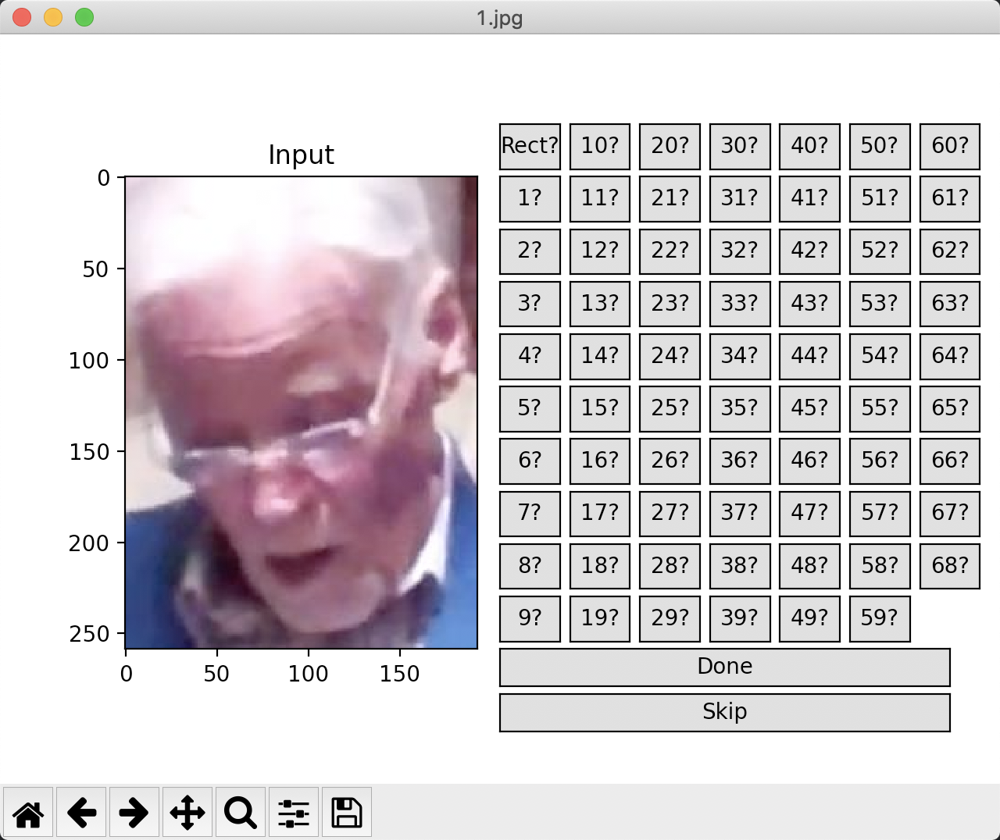
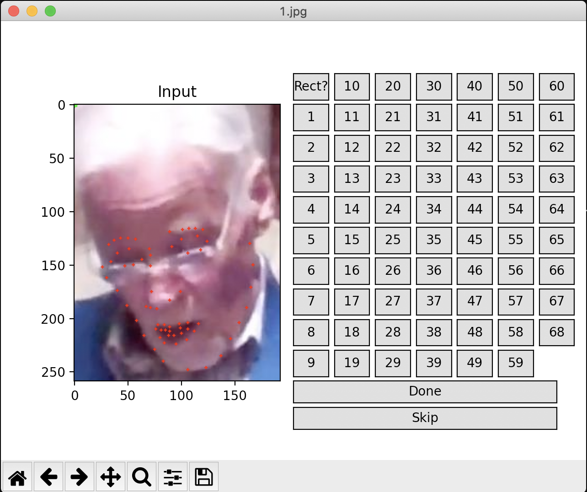

# Faces Annotation Tool: 68 Landmarks

This is a fork of the original Face-Annotation-Tool Github repository. I have updated the code to enable landmarking of 68 facial landmarks, rather than 6. Please note that labeling of bounding boxes is NOT currently supported in this version of the code. Bounding boxes are supported in the original code base.
-Nate Thom

It is a very simple GUI facial landmark annotation tool using Matplotlib and OpenCV.

This version helps you manually annotate 68 points. The traditional 68 landmark scheme is shown below... 


## How to use

To run this demo:

```python
 python annotate_faces.py -d ./demo/
```

## GUI





- By default, the program will start in the state to begin labeling for landmark 1. Click the corresponding point on the face to input coordinates. The program will automatically advance to label landmark 2. If you continue to click points on the image, the program will continue advancing to the next label.

- If you want to change or remove a label, click the button which corresponds to the label. If you do nothing the label will be removed and if you click the image the label will be overwritten.

- Note that the program will always move to the next label in numerical order. For example, if you are on landmark 1 the next state will be landmark 2. If you are on landmark 68, the next state will be landmark 1

- If no label is provided for some landmark, the default value will be assumed "(-1, -1)"

- Done: finish with current image

- Skip: skip current image

You can run the script for a single image or multiple images in a directory. Points are output to terminal in csv format, and save at the script's location as txt.

Sample output:
```
./demo/1.jpg	image_name,x_0,x_1,x_2,x_3,x_4,x_5,x_6,x_7,x_8,x_9,x_10,x_11,x_12,x_13,x_14,x_15,x_16,x_17,x_18,x_19,x_20,x_21,x_22,x_23,x_24,x_25,x_26,x_27,x_28,x_29,x_30,x_31,x_32,x_33,x_34,x_35,x_36,x_37,x_38,x_39,x_40,x_41,x_42,x_43,x_44,x_45,x_46,x_47,x_48,x_49,x_50,x_51,x_52,x_53,x_54,x_55,x_56,x_57,x_58,x_59,x_60,x_61,x_62,x_63,x_64,x_65,x_66,x_67,y_0,y_1,y_2,y_3,y_4,y_5,y_6,y_7,y_8,y_9,y_10,y_11,y_12,y_13,y_14,y_15,y_16,y_17,y_18,y_19,y_20,y_21,y_22,y_23,y_24,y_25,y_26,y_27,y_28,y_29,y_30,y_31,y_32,y_33,y_34,y_35,y_36,y_37,y_38,y_39,y_40,y_41,y_42,y_43,y_44,y_45,y_46,y_47,y_48,y_49,y_50,y_51,y_52,y_53,y_54,y_55,y_56,y_57,y_58,y_59,y_60,y_61,y_62,y_63,y_64,y_65,y_66,y_67
```

## Reference

[annotate-faces](https://github.com/waldr/annotate-faces)
